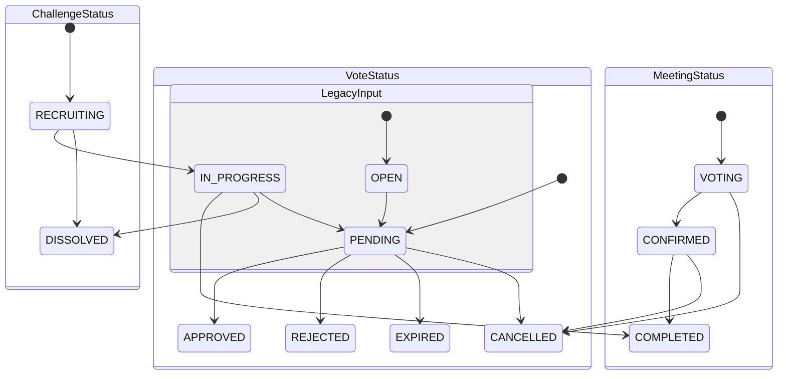

# Output 04 - User Flow Charts

- Generated: 2026-02-24
- Source docs: UX_FLOW / USE_CASES / PRODUCT_AGENDA
- Source code: implemented endpoint set

## 1) New user -> challenge join

```mermaid
flowchart TD
    A[Entry] --> B{Existing member?}
    B -->|No| C[Sign up /auth/signup]
    C --> D[Login /auth/login]
    B -->|Yes| D
    D --> E[Check account /accounts/me]
    E --> F{Enough balance?}
    F -->|No| G[Charge /accounts/charge -> callback]
    G --> E
    F -->|Yes| H[Browse challenges /challenges]
    H --> I[Join /challenges/{id}/join]
    I --> J[Member list /challenges/{id}/members]
```

## 2) Meeting -> attendance -> expense vote -> ledger graph

```mermaid
flowchart TD
    A[Leader creates meeting] --> B[Members respond attendance]
    B --> C[Leader completes meeting with actual attendees]
    C --> D[Create EXPENSE vote]
    D --> E[Eligible attendees cast votes]
    E --> F{Approval reached?}
    F -->|Yes| G[Expense approved + barcode used + ledger entry]
    F -->|No| H[Rejected or expired]
    G --> I[Ledger list /challenges/{id}/ledger]
    G --> J[Graph /challenges/{id}/account/graph]
```

## 3) BRIX update and exposure

```mermaid
flowchart TD
    A[Monthly scheduler 1st day 03:00 KST] --> C[Spring aggregates metrics]
    B[Manual trigger POST /internal/django/brix/recalculate] --> C
    C --> D[Django POST /internal/brix/calculate]
    D --> E[user_scores.total_score upsert]
    E --> F[/users/me /users/{id} /challenges/{id}/members expose BRIX]
```

## 4) Notification flow

```mermaid
flowchart TD
    A[Domain event] --> B[Create notification row]
    B --> C[List /notifications]
    C --> D[Read one /notifications/{id}/read]
    C --> E[Read all /notifications/read-all]
    C --> F[Settings /notifications/settings]
```

## 5) State transition


