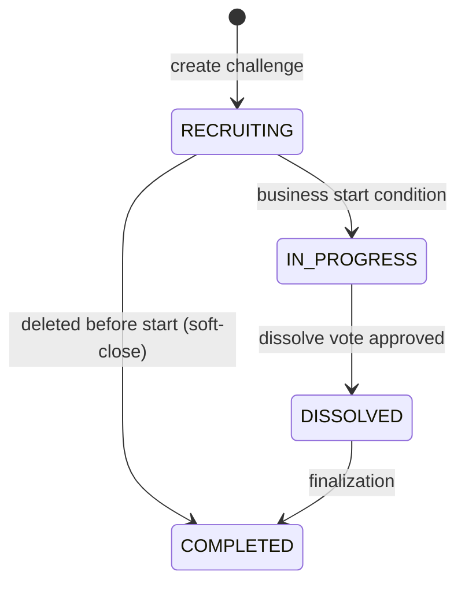
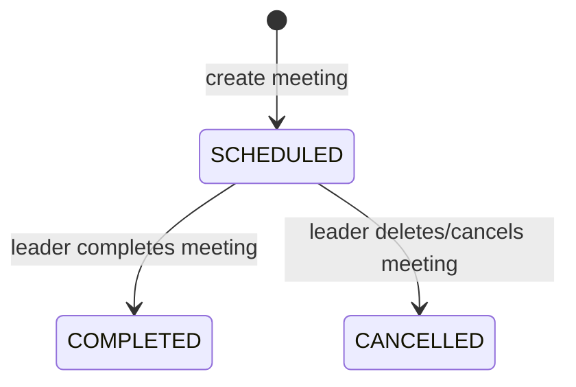
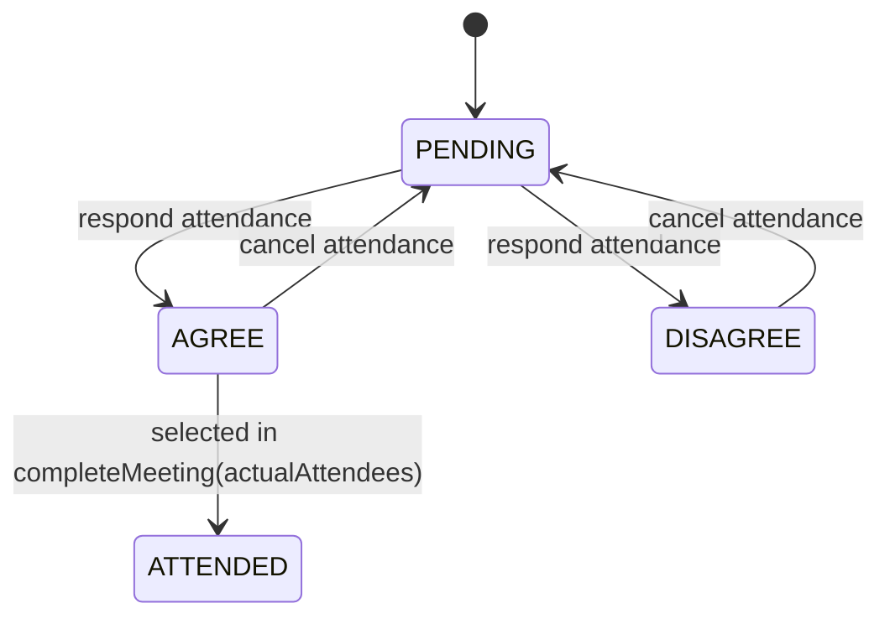
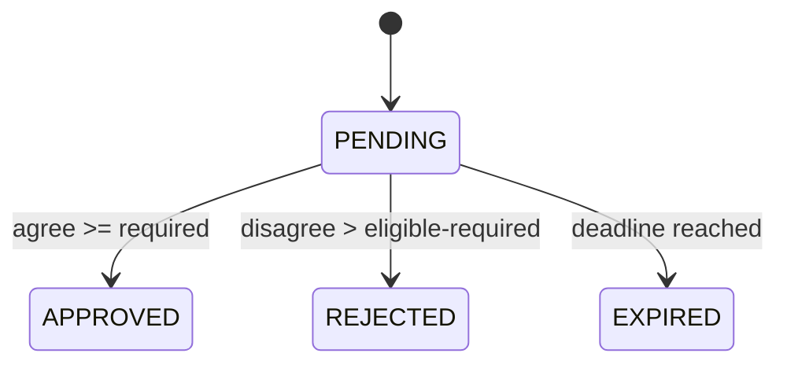
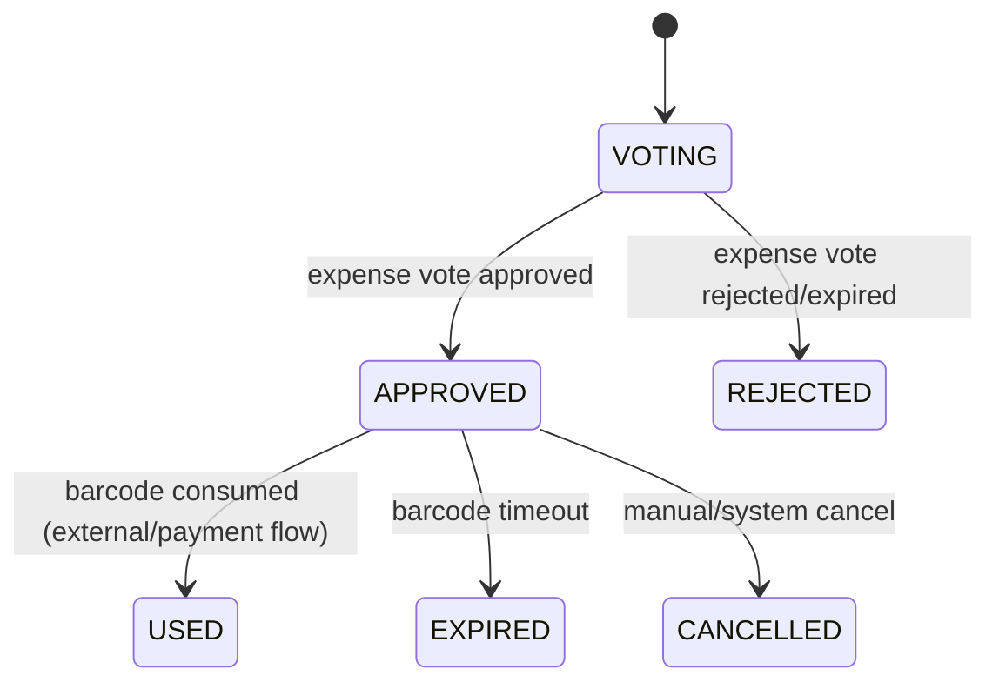
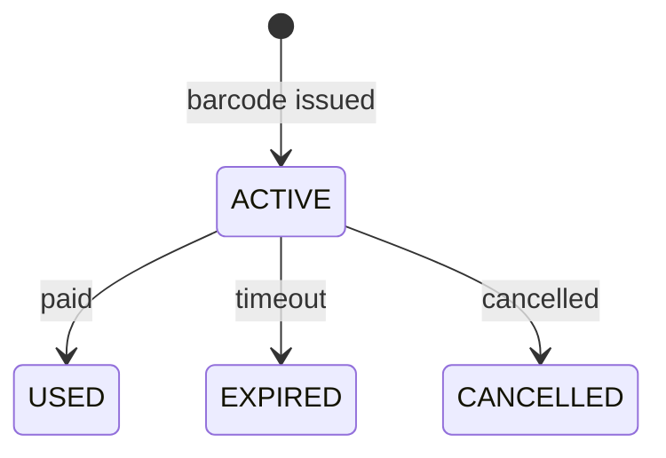
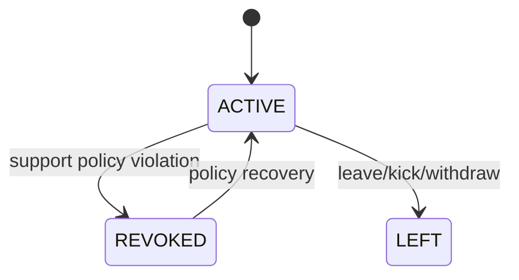

# Output 08 - State Machines (Domain Lifecycle)

- Generated: 2026-02-24 15:40:56
- Source: service logic + enums in backend domain models

## 1) Challenge Status

Evidence:
- `backend/src/main/java/com/woorido/challenge/domain/ChallengeStatus.java`
- `backend/src/main/java/com/woorido/challenge/service/ChallengeService.java`

## 2) Meeting Status

Evidence:
- `backend/src/main/java/com/woorido/meeting/service/MeetingService.java:183`
- `backend/src/main/java/com/woorido/meeting/service/MeetingService.java:388`
- `backend/src/main/java/com/woorido/meeting/service/MeetingService.java:483`

## 3) Meeting Vote Record (Attendance Response)

Evidence:
- `backend/src/main/java/com/woorido/meeting/service/MeetingService.java:319`
- `backend/src/main/java/com/woorido/meeting/service/MeetingService.java:388`

## 4) Vote Status

Evidence:
- `backend/src/main/java/com/woorido/vote/service/VoteService.java:900`
- `backend/src/main/java/com/woorido/vote/service/VoteService.java:824`

## 5) Expense Request and Payment Barcode

Evidence:
- `backend/src/main/java/com/woorido/vote/service/VoteService.java:724`
- `backend/src/main/java/com/woorido/vote/service/VoteService.java:736`
- `backend/src/main/java/com/woorido/expense/domain/ExpenseRequestStatus.java`
- `backend/src/main/java/com/woorido/expense/domain/PaymentBarcodeStatus.java`

## 6) Challenge Member Privilege

Evidence:
- `backend/src/main/java/com/woorido/challenge/service/ChallengeService.java`
- `backend/src/main/resources/mapper/challenge/ChallengeMemberMapper.xml`
