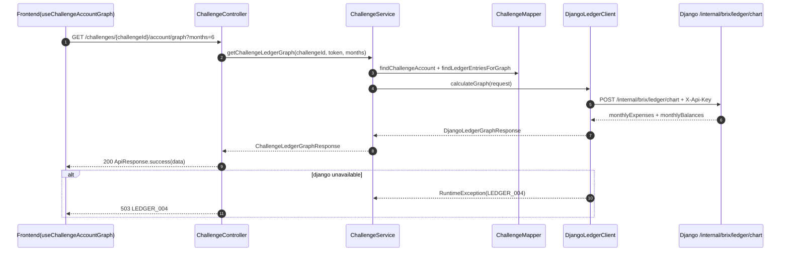
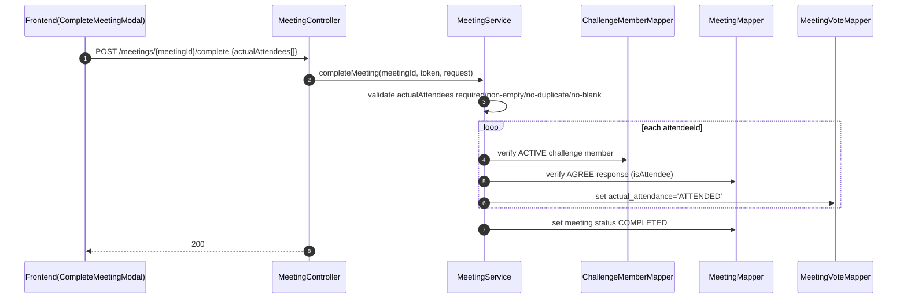
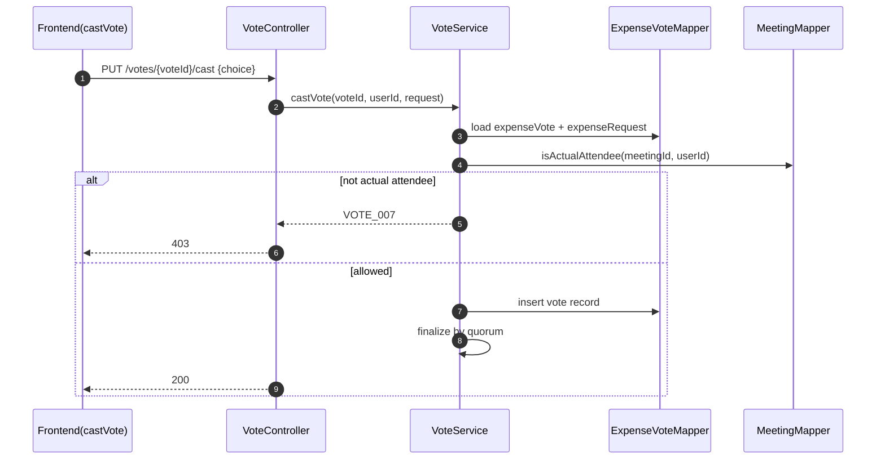
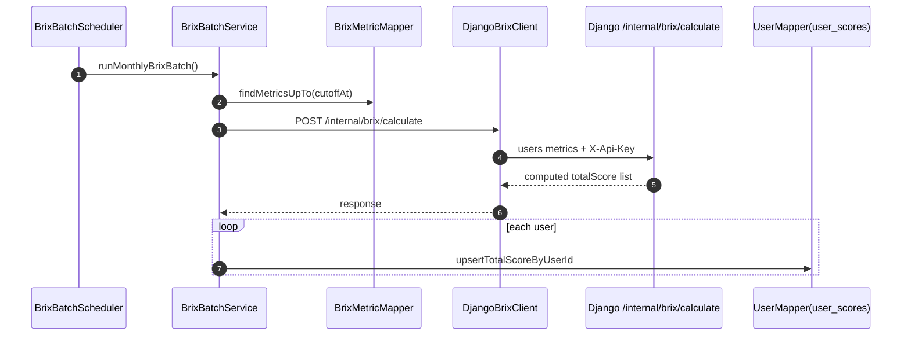

# OUTPUT 09 - Core Sequence Diagrams (Implementation-Based)

- Generated: 2026-02-24 15:40:56
- Source scope: backend services/controllers, django views, frontend hooks/apis
- Scanned files: **715**

## 1) Ledger Graph Read (`GET /challenges/{challengeId}/account/graph`)

## 2) Complete Meeting with Actual Attendees

## 3) Expense Vote Cast Eligibility

## 4) BRIX Monthly Batch and Manual Trigger

